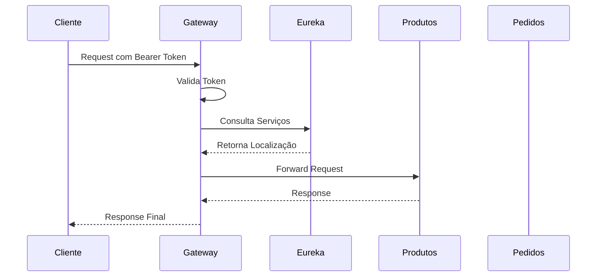

# Documentação da Arquitetura

## Visão Geral
Este documento descreve a arquitetura do sistema de gestão de pedidos e catálogo de produtos implementado com microsserviços.

## Componentes Principais

### 1. Eureka Server (Service Discovery)
- **Responsabilidade**: Registro e descoberta de serviços
- **Porta**: 8761
- **Tecnologias**: Spring Cloud Netflix Eureka
- **Endpoint**: http://localhost:8761

### 2. API Gateway
- **Responsabilidade**: Roteamento, segurança, rate limiting
- **Porta**: 8700
- **Tecnologias**: Spring Cloud Gateway
- **Recursos**:
  - Autenticação via Token Bearer
  - Rate Limiting
  - CORS
  - Load Balancing

### 3. Serviço de Produtos
- **Responsabilidade**: Gerenciamento do catálogo de produtos
- **Porta**: 8100
- **Tecnologias**: 
  - Spring Boot
  - H2 Database
  - Spring Data JPA
- **Endpoints**:
  - GET /produtos
  - GET /produtos/{id}
  - POST /produtos
  - PUT /produtos/{id}
  - DELETE /produtos/{id}

### 4. Serviço de Pedidos
- **Responsabilidade**: Simulação de pedidos
- **Porta**: 8200
- **Tecnologias**:
  - Spring Boot
  - Spring Cloud OpenFeign
  - Resilience4j
- **Endpoints**:
  - GET /pedidos/produtos
  - POST /pedidos/simular

## Comunicação entre Serviços

## Monitoramento e Observabilidade

### Prometheus + Grafana
- Métricas de performance
- Health checks
- Uso de recursos

### Zipkin
- Distributed tracing
- Análise de latência
- Diagnóstico de problemas

## Segurança

### API Gateway
- Autenticação via Token Bearer
- Validação de tokens
- Rate limiting por IP/cliente
- Políticas de CORS

### Microsserviços
- Comunicação segura via HTTPS
- Validação de dados
- Tratamento de erros
- Logs seguros

## Escalabilidade

- Serviços stateless
- Load balancing automático
- Service discovery dinâmico
- Circuit breaker para resiliência